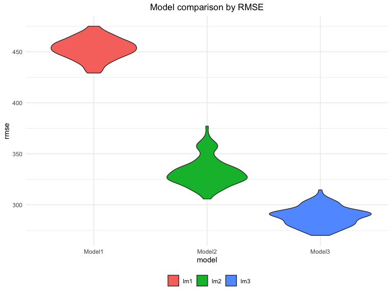
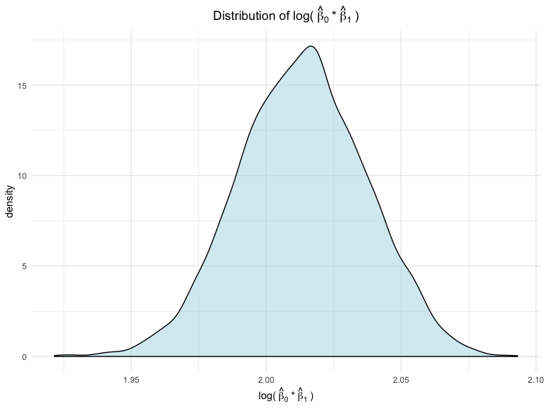
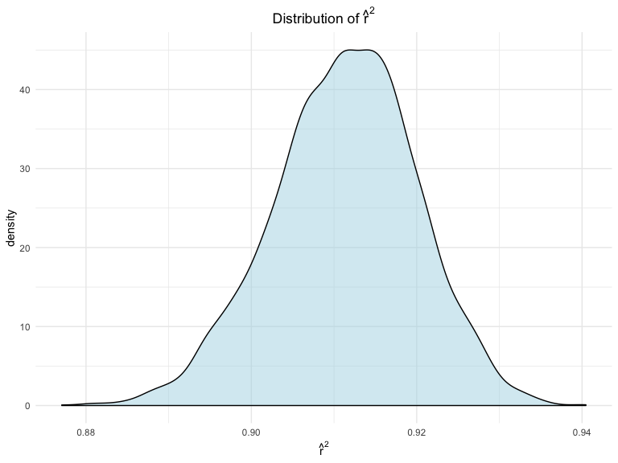

p8105\_hw6\_xj2249
================
xj2249
11/14/2019

# Problem1

## load and clean data

``` r
bw_df <- 
        read_csv("./data/birthweight.csv") %>% 
        janitor::clean_names() %>% 
        mutate(
                babysex = factor(babysex, labels = c("male","female")),
                frace = factor(frace, labels = c("White","Black","Asian","Puerto Rican","Other")),
                malform = factor(malform, labels = c("absent","present")),
                mrace = factor(mrace, labels = c("White","Black", "Asian", "Puerto Rican"))
                )
skimr::skim(bw_df)
```

## Model1: my model\!

I’d like to put sex and the gestational age of the baby, mom’s weight
gain during pregnancy and pre-pregnancy BMI into my model, and the
reason is following: generally, boy and baby with longer gestational age
will have larger birthweight and therefore sex and gestational age are
picked. Then, mom’s weight gain during pregnancy and pre-pregnancy BMI
may also be important, since baby gain all their nutrition from moms.

**Here we go\!**

``` r
bw_lm1 <- 
        bw_df %>% 
        lm(bwt~ babysex + gaweeks + ppbmi + wtgain, data = .) 

bw_df %>% 
        add_predictions(bw_lm1) %>% 
        add_residuals(bw_lm1) %>% 
        ggplot(aes(x = pred, y = resid)) +
        geom_smooth(se = F,size = 0.5) + 
        geom_point() +
        geom_hline(yintercept = 0,col = "red",linetype = "dashed") + 
        labs( x = "Fitted values", y = "Residuals", title = "Residual vs Fitted Plot")
```


## Model2

Fit model2 with length at birth and gestational age as predictors.

``` r
bw_lm2 <- 
        bw_df %>% 
        lm(bwt~ blength + gaweeks, data = .) 
```

## Model3

Fit model3 with head circumference, length, sex, and all interactions.

``` r
bw_lm3 <-
        bw_df %>% 
        lm(bwt~ blength*bhead*babysex, data = .) 
```

## Cross validation

### generate training and testing datasets

``` r
cv_df <- 
        crossv_mc(bw_df,100) %>% 
        mutate(train = map(train,as_tibble),
               test = map(test,as_tibble))
```

### let’s fit models and assess predition accuracy

``` r
cross_result <-
        cv_df %>% 
        mutate( lm1 =  map(.x = train,~lm(bwt~ babysex + gaweeks + ppbmi + wtgain, data = .x)),
                lm2 =  map(.x = train,~lm(bwt~ blength + gaweeks, data = .x)),
                lm3 =  map(.x = train,~lm(bwt~ blength*bhead*babysex, data = .x)),
                rmse_lm1 = map2_dbl(.x = lm1, .y = test, ~rmse(.x,.y)),
                rmse_lm2 = map2_dbl(.x = lm2, .y = test, ~rmse(.x,.y)),
                rmse_lm3 = map2_dbl(.x = lm3, .y = test, ~rmse(.x,.y))
                ) %>% 
        select(starts_with("rmse")) %>% 
        pivot_longer(
                everything(),
                names_to = "model",
                values_to = "rmse",
                names_prefix = "rmse_") 

cross_result %>%
        mutate(model = factor(model)) %>% 
        ggplot(aes(x = model, y = rmse,fill = model)) +
        geom_violin() +
        labs( title = "Model comparison by RMSE") +
        scale_x_discrete(labels = c("Model1","Model2","Model3"))
```



It breaks my heart\! My model looks worst…with much higher RMSEs than
other two models. The third one is the best, with the lowest RMSEs and
the second model ranks second.

# Problem2

## Point estimates

``` r
slr = lm(tmax~tmin, data = weather_df)

point_estimates <- tibble(log_b0_b1 =
                                  slr %>% 
                                  broom::tidy() %>% 
                                  pull(estimate) %>% 
                                  prod() %>% 
                                  log() ,
                          r_squared = slr %>% 
                                  broom::glance() %>% 
                                  pull(r.squared) 
                          )

point_estimates %>%  kableExtra::kable(caption = "point estimates",digits = 3)
```

<table>

<caption>

point estimates

</caption>

<thead>

<tr>

<th style="text-align:right;">

log\_b0\_b1

</th>

<th style="text-align:right;">

r\_squared

</th>

</tr>

</thead>

<tbody>

<tr>

<td style="text-align:right;">

2.014

</td>

<td style="text-align:right;">

0.912

</td>

</tr>

</tbody>

</table>

## Boostrap\!\!\!

``` r
estimates <-
        weather_df %>% 
        bootstrap(5000) %>% 
        mutate(slr = map(.x = strap, ~lm(tmax~tmin, data = .x)),
               est1 = map(slr,broom::tidy),
               est2 = map(slr,broom::glance),
               log_b0_b1 = map_dbl(.x = est1, ~.x %>% pull(estimate) %>% prod %>% log ),
               r_squared = map_dbl(.x = est2, ~.x %>% pull(r.squared))
               ) %>% 
        select(.id,log_b0_b1,r_squared)
```

## Plot distribution of estimates

``` r
estimates %>% 
        ggplot(aes(x = log_b0_b1)) +
        geom_density(fill = "lightblue",alpha = 0.5) +
        labs( x = expression("log("~hat(beta)[0]~"*"~hat(beta)[1]~")"),
              title = expression("Distribution of log("~hat(beta)[0]~"*"~hat(beta)[1]~")"))
```



``` r
estimates %>% 
        ggplot(aes(x = r_squared)) +
        geom_density(fill = "lightblue",alpha = 0.5) +
        labs( x = expression(hat(r)^2),
              title = expression("Distribution of"~hat(r)^2))
```



## 95% confidence intervals

``` r
ci <- 
        estimates %>% 
        pivot_longer(
                -.id,
                names_to = "estimates",
                values_to = "value"
        ) %>% 
        group_by(estimates) %>% 
        summarise( p2.5 = quantile(value,0.025),
                   p97.5 = quantile(value,0.975),
                  se = sd(value)
        ) %>% 
        cbind(., point_estimates = t(point_estimates)) %>% 
        mutate( CI_lower = round(point_estimates -  se * p2.5,digits = 3),
                CI_upper = round(point_estimates +  se * p97.5,digits = 3),
                CI = str_c(CI_lower,CI_upper,sep = ",")) 

ci %>%  kableExtra::kable(caption = "95% confidence interval",digits = 3,align = "c")
```

<table>

<caption>

95% confidence interval

</caption>

<thead>

<tr>

<th style="text-align:center;">

estimates

</th>

<th style="text-align:center;">

p2.5

</th>

<th style="text-align:center;">

p97.5

</th>

<th style="text-align:center;">

se

</th>

<th style="text-align:center;">

point\_estimates

</th>

<th style="text-align:center;">

CI\_lower

</th>

<th style="text-align:center;">

CI\_upper

</th>

<th style="text-align:center;">

CI

</th>

</tr>

</thead>

<tbody>

<tr>

<td style="text-align:center;">

log\_b0\_b1

</td>

<td style="text-align:center;">

1.967

</td>

<td style="text-align:center;">

2.059

</td>

<td style="text-align:center;">

0.024

</td>

<td style="text-align:center;">

2.014

</td>

<td style="text-align:center;">

1.967

</td>

<td style="text-align:center;">

2.062

</td>

<td style="text-align:center;">

1.967,2.062

</td>

</tr>

<tr>

<td style="text-align:center;">

r\_squared

</td>

<td style="text-align:center;">

0.894

</td>

<td style="text-align:center;">

0.927

</td>

<td style="text-align:center;">

0.009

</td>

<td style="text-align:center;">

0.912

</td>

<td style="text-align:center;">

0.904

</td>

<td style="text-align:center;">

0.920

</td>

<td style="text-align:center;">

0.904,0.92

</td>

</tr>

</tbody>

</table>

Therefore, the 95% confidence interval for log\_b0\_b1 is (1.967,2.062),
for r\_hat\_squared is (0.904,0.92).
